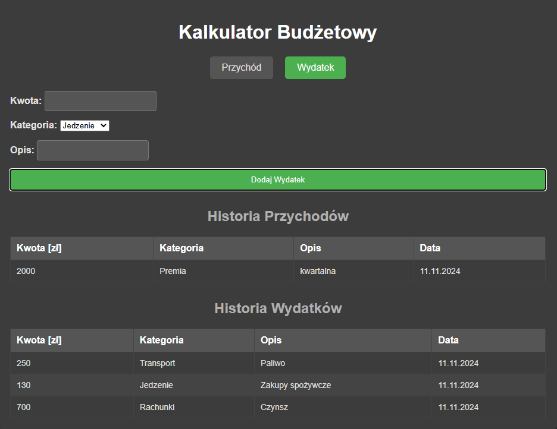

# Kalkulator Budżetowy

Aplikacja webowa do zarządzania budżetem domowym. Umożliwia użytkownikowi monitorowanie przychodów i wydatków, a także podział transakcji na różne kategorie, co pozwala na lepsze zarządzanie finansami osobistymi. Aplikacja umożliwia dodawanie, edytowanie i usuwanie transakcji, a także generowanie podsumowań budżetowych, które pomagają w kontrolowaniu wydatków.

## Funkcjonalności

- **Zarządzanie przychodami i wydatkami** – użytkownicy mogą dodawać przychody i wydatki, przypisując je do odpowiednich kategorii.
- **Podział na kategorie** – przychody i wydatki można klasyfikować w kategorie takie jak: Jedzenie, Transport, Rozrywka, itp.
- **Historia transakcji** – aplikacja przechowuje historię dodanych przychodów i wydatków, umożliwiając ich przeglądanie.
- **Podsumowanie budżetu** – aplikacja wyświetla podsumowanie, pokazujące całkowity bilans, wydatki w poszczególnych kategoriach oraz dostępne środki.
- **Użycie bazy danych SQLite** – wszystkie dane są przechowywane w lokalnej bazie danych SQLite.

## Technologie

- **Frontend**: HTML, CSS, JavaScript (czysty JS)
- **Backend**: ASP.NET Core API
- **Baza danych**: SQLite
- **Środowisko uruchomieniowe**: .NET Core 6.0

## Instalacja

1. **Skopiuj repozytorium**:
git clone https://github.com/JoannaBorowiak/HomeBudget.git

2. **Instalacja zależności**:
Jeśli nie masz zainstalowanego .NET SDK, pobierz i zainstaluj [najnowszą wersję .NET](https://dotnet.microsoft.com/download).

3. **Uruchom aplikację**:
W terminalu przejdź do folderu projektu i uruchom polecenie:
dotnet run

Aplikacja powinna być dostępna pod adresem: [https://localhost:5085](https://localhost:5085).

## Użycie

1. **Dodawanie przychodów/wydatek**:
Aby dodać nowy przychód lub wydatek, kliknij odpowiednią zakładkę i wypełnij formularz.

2. **Podgląd historii**:
Można przeglądać wszystkie dodane transakcje w tabelach "Dochody" oraz "Wydatki".

## Wersje

- **Wersja 1.0** - Pierwsza wersja aplikacji, umożliwiająca dodawanie przychodów, wydatków oraz generowanie prostego podsumowania.

## Przykład

Oto przykład, jak może wyglądać widok aplikacji:

## Rozwój i przyszłe funkcje

W przyszłości planowane jest dodanie:

- Możliwości edytowania i usuwania transakcji.
- Dodanie podsumowanie budżetu
- Przeniesienie aplikacji na chmurę i integracja z bazą danych SQL Server.
- Lepsza analiza wydatków z wykresami i raportami.

   
